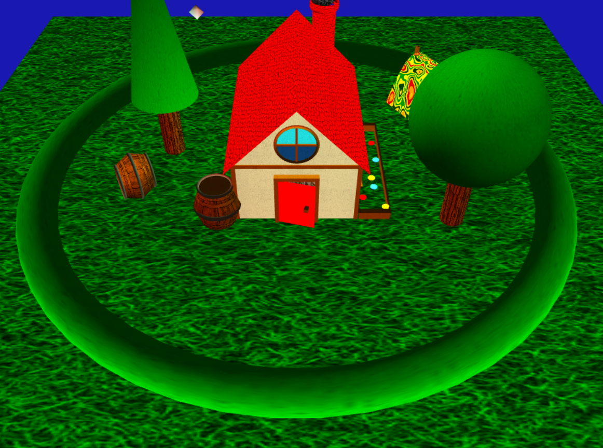
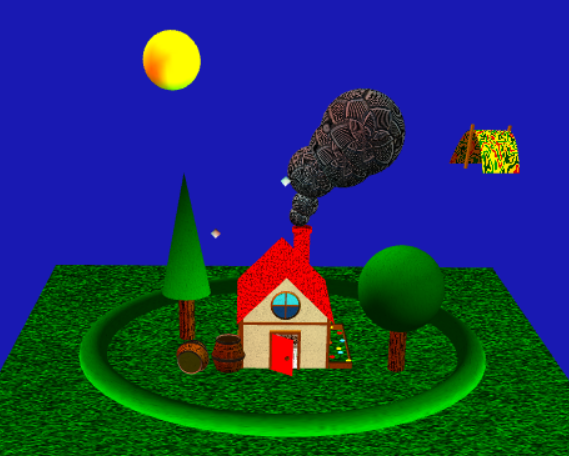
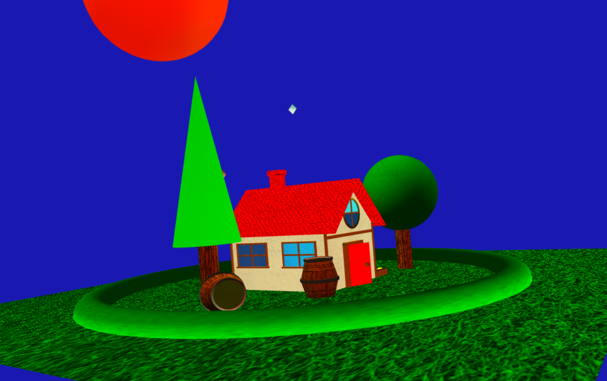
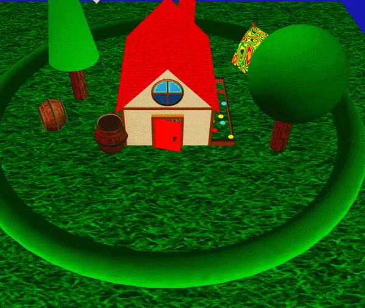
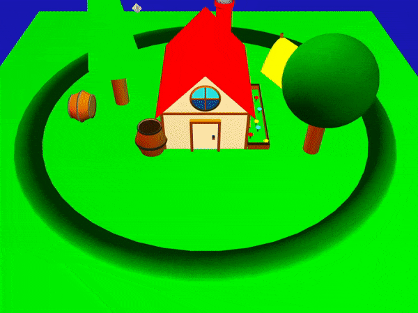

# SGI 2022/2023 - TP2

## Group: T03G01

| Name           | Number    | E-Mail            |
| -------------- | --------- | ----------------- |
| Miguel Freitas | 201906159 | up201906159@up.pt |
| Joana Mesquita | 201907878 | up201907878@up.pt |

---

## What we did

- All requested features were implemented.
- Non-uniform rational B-spline (NURBS)
- Shaders
- Animations
- Fixed a couple issues found in the last part of the project

---
## Project information

We added to our original scene of a house with a garden a tent and two barrels as well as modified all windows to be patches so they would interact with light differently. Furthermore we added 4 distinct animations:
- A barrel rolling, colliding with another barrel and rolling back until slowly coming to a stop
- The door of the house slowly opening
- The tent getting blown by the wind
- The smoke from the chimney slowly coming out and disappearing

Lastly we added the requested shader (one that makes the object pulse and change color) to both the sun and a cone-shaped tree in our scene

---
## Improvements made
  - Some objects were previously not grouped in comments in a way that made it easier to change their material
  - While texture length_s and length_t were active the textures were not being set to repeat when needed and would just stretch in whatever direction was needed

---
## Scene
[Scene open with Live Server on port 5500](http://127.0.0.1:5500/tp2/index.html)

