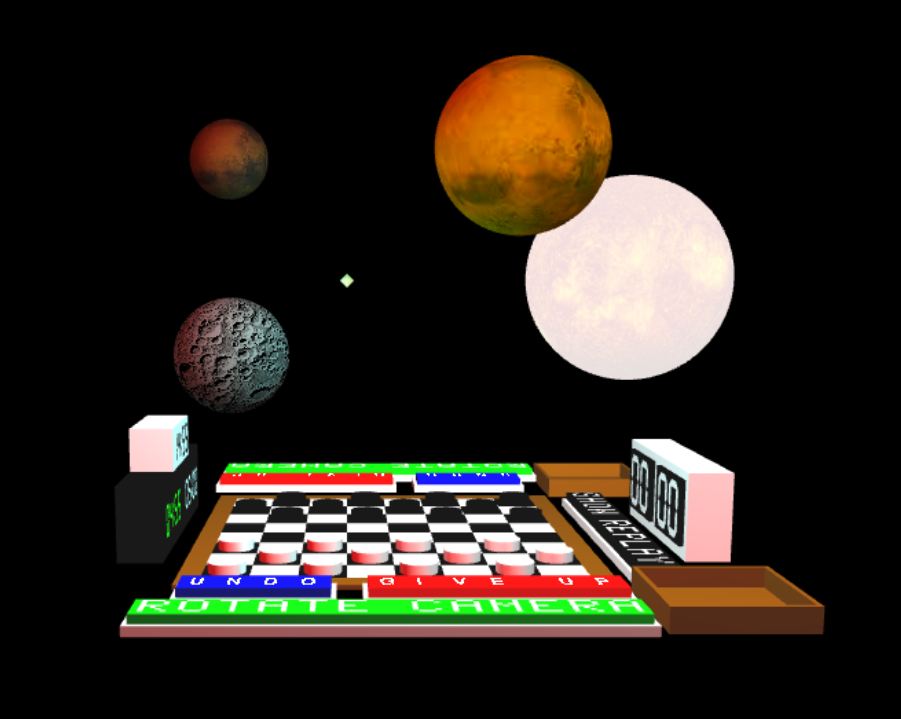
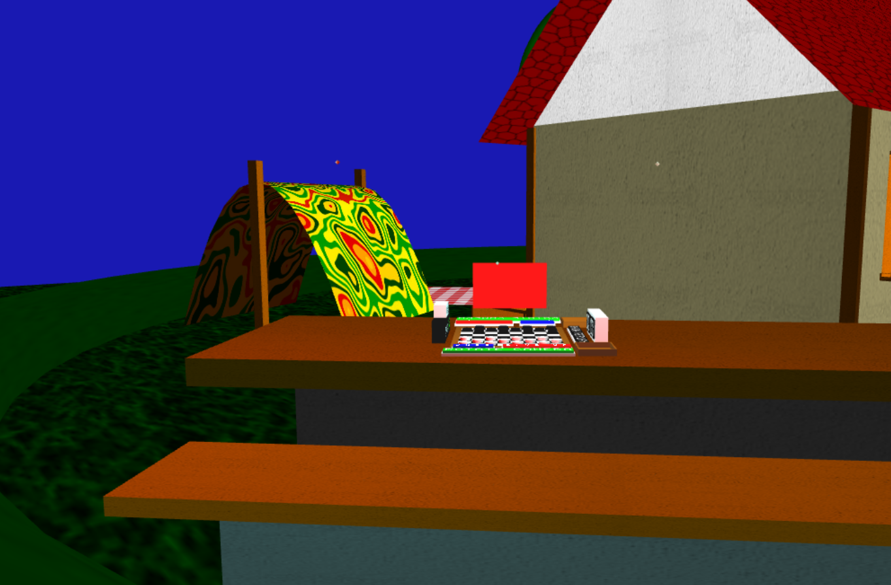
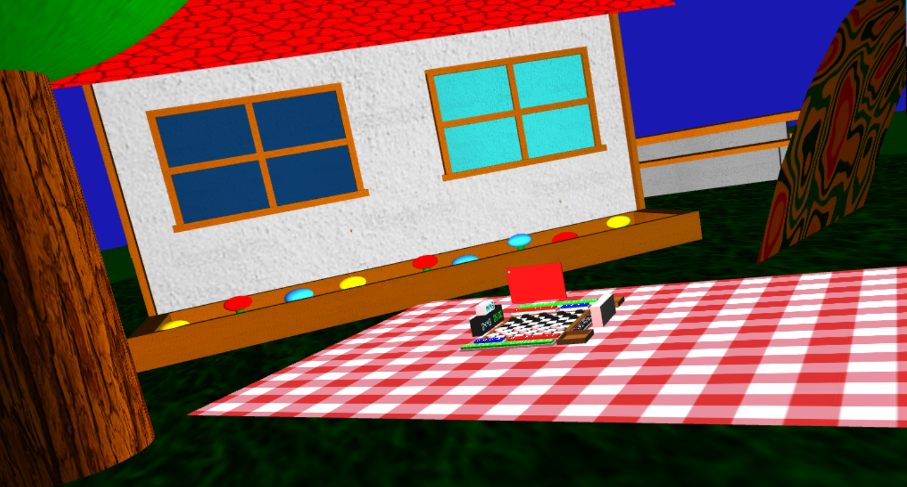
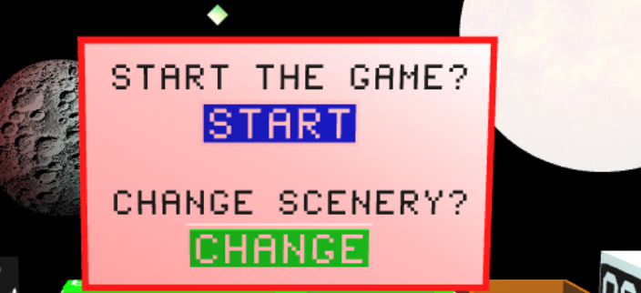
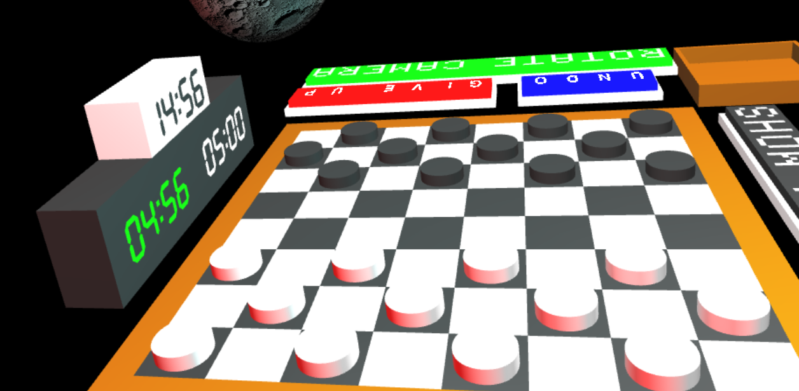
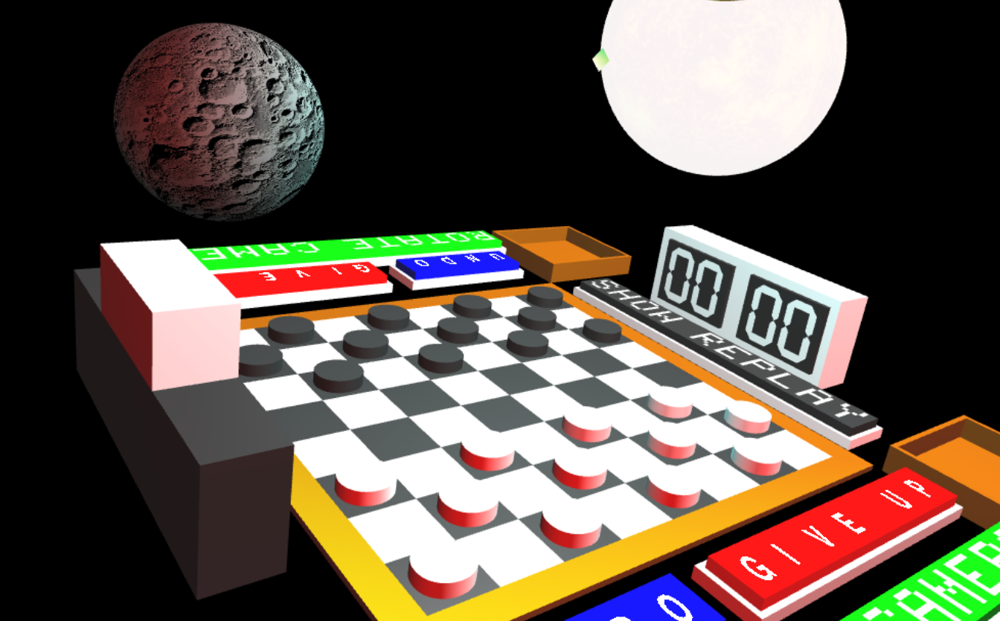

# SGI 2022/2023 - TP3

## Group: T03G01

| Name           | Number    | E-Mail            |
| -------------- | --------- | ----------------- |
| Miguel Freitas | 201906159 | up201906159@up.pt |
| Joana Mesquita | 201907878 | up201907878@up.pt |

---
## Project information
  For the project we created a checkers game with the features specified using a slightly altered version of our second project as the scene as well as a simple space scene.
  
  
---

## What we didn't do

- Spotlight due to lack of time
- Pop Ups for invalid moves since with the way we set up the picking in our project it is impossible to make invalid moves as well as very clear what moves are actually possible

---
## Scene
[Scene open with Live Server on port 5500](http://127.0.0.1:5500/tp3/index.html)

